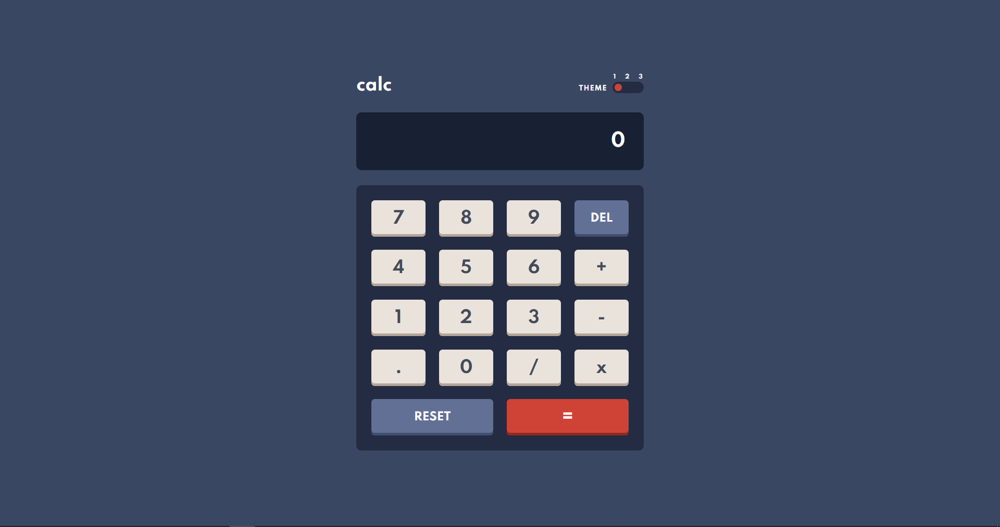

## Table of contents

- [Overview](#overview)
  - [The challenge](#the-challenge)
  - [Screenshot](#screenshot)
  - [Built with](#built-with)
- [Author](#author)

## Overview

### The challenge

Users should be able to:

- See the size of the elements adjust based on their device's screen size
- Perform mathmatical operations like addition, subtraction, multiplication, and division
- Adjust the color theme based on their preference
- **Bonus**: Have their initial theme preference checked using `prefers-color-scheme` and have any additional changes saved in the browser

### Screenshot

### Built with

- Semantic HTML5 markup
- CSS custom properties
- Flexbox
- CSS Grid
- CSS Variables

### Links

- Solution URL: [https://github.com/mhuseynli/Calculator-Multi-Theme](https://github.com/mhuseynli/Calculator-Multi-Theme)
- Live Site URL: [https://calculator-multi-theme.vercel.app/](https://calculator-multi-theme.vercel.app/)

## Author

- Website - [devmrd](https://devmrd.tk)
- Frontend Mentor - [@mhuseynli](https://www.frontendmentor.io/profile/mhuseynli)
